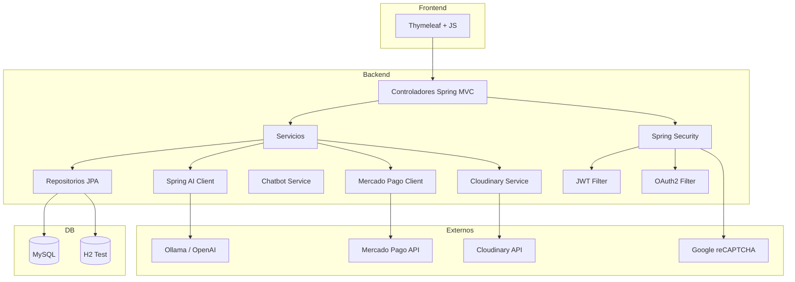

# 🍻 Costa de Oro Imports

[](https://adoptium.net/)
[](https://spring.io/projects/spring-boot)
[](https://spring.io/projects/spring-ai)
[](https://www.mysql.com/)
[](https://www.docker.com/)
[](https://github.com/features/actions)
[](https://github.com/dependabot)
[](LICENSE)

---

**Aplicación web de e-commerce** para la gestión y venta de bebidas alcohólicas premium, desarrollada con **Spring Boot 4.1** y **Spring AI 2.0**, que integra un chatbot inteligente (*CostaBot*), pasarela de pago (Mercado Pago), almacenamiento en la nube (Cloudinary), autenticación OAuth2 (Google), JWT, recordatorio de sesión, reCAPTCHA, y un completo panel administrativo. Todo orquestado con **Docker**, **GitHub Actions** y **Dependabot** para una entrega continua y segura.

---

## 📋 Tabla de Contenidos

1. [Características](#-características)
2. [Arquitectura](#-arquitectura)
3. [Tecnologías](#-tecnologías)
4. [Requisitos previos](#-requisitos-previos)
5. [Instalación y configuración](#-instalación-y-configuración)
6. [Variables de entorno](#-variables-de-entorno)
7. [Configuración de servicios externos](#-configuración-de-servicios-externos)
8. [Docker y Docker Compose](#-docker-y-docker-compose)
9. [GitHub Actions (CI/CD)](#-github-actions-cicd)
10. [Dependabot](#-dependabot)
11. [Seguridad](#-seguridad)
12. [CostaBot – Chatbot con IA](#-costabot--chatbot-con-ia)
13. [MCP (Model Context Protocol)](#-mcp-model-context-protocol)
14. [Marketplace y Flujo de compra](#-marketplace-y-flujo-de-compra)
15. [Roles del sistema](#-roles-del-sistema)
16. [Estructura del proyecto](#-estructura-del-proyecto)
17. [API y Endpoints](#-api-y-endpoints)
18. [Roadmap](#-roadmap)
19. [Contribuciones](#-contribuciones)
20. [Licencia](#-licencia)
21. [Autor](#-autor)

---

## ✨ Características

| Área | Funcionalidad |
|------|---------------|
| 🛒 **E‑commerce** | Catálogo dinámico de productos (cervezas, vinos, licores), carrito de compras, gestión de inventario, panel administrativo, autenticación y gestión de usuarios. |
| 🤖 **CostaBot** | Chatbot inteligente con IA generativa (Spring AI) que responde en tiempo real (streaming), renderiza Markdown, indica "escribiendo...", y mantiene una temática comercial natural. |
| 💳 **Pasarela de pago** | Integración con **Mercado Pago** para pagos con tarjeta, transferencia y medios locales. |
| ☁️ **Almacenamiento en nube** | Subida y gestión de imágenes de productos mediante **Cloudinary**. |
| 🔐 **Seguridad reforzada** | Autenticación con JWT, OAuth2 (Google), *Remember Me*, reCAPTCHA v3, protección CSRF, cifrado de contraseñas (BCrypt), y auditoría de accesos. |
| 🐳 **DevOps** | Contenedores con Docker y orquestación con Docker Compose; pipeline CI/CD con GitHub Actions; actualización automática de dependencias con Dependabot. |
| 📊 **Monitorización** | Spring Boot Actuator para métricas, health checks y entorno de pruebas H2. |
| 🧠 **IA y ML** | Integración con **Weka** para análisis de datos y recomendaciones (futuro). |
| 🌐 **Internacionalización** | Soporte multiidioma (preparado para español/inglés). |

---

## 🏗️ Arquitectura



---

## 🛠️ Tecnologías

### Backend

- **Java 21 (LTS)**
- **Spring Boot 4.1.0** (Web, Security, Data JPA, Actuator, WebFlux)
- **Spring AI 2.0.0** (integración con Ollama/OpenAI)
- **Spring Security** (JWT, OAuth2, Remember Me, BCrypt)
- **Hibernate / JPA**
- **MySQL Connector / H2 Database**
- **Lombok**
- **Weka** (análisis de datos)

### Frontend

- **Thymeleaf** (motor de plantillas)
- **HTML5, CSS3, JavaScript (ES6)**
- **Marked.js** (renderizado Markdown en chat)
- **Remix Icons / Font Awesome**

### DevOps y herramientas

- **Docker y Docker Compose**
- **GitHub Actions** (CI/CD)
- **Dependabot**
- **Maven** (gestor de dependencias)
- **Git**

### Servicios externos

- **Mercado Pago** (pasarela de pagos)
- **Cloudinary** (almacenamiento de imágenes)
- **Google OAuth2**
- **Google reCAPTCHA v3**
- **Ollama** (modelos de IA locales) o **OpenAI API**

---

## 📋 Requisitos previos

- JDK 21 o superior
- Maven 3.9+
- MySQL 8.0+ (o Docker)
- Docker y Docker Compose (opcional)
- Ollama (si se usa modelo local) o clave API de OpenAI
- Cuenta en Mercado Pago (para credenciales)
- Cuenta en Cloudinary (para almacenamiento)
- Cuenta en Google Cloud Console (OAuth2)
- Clave de reCAPTCHA v3

> [!NOTE]
> Si deseas desarrollo rápido sin configurar servicios externos, puedes usar los perfiles `dev` con bases de datos H2 y un modelo IA local con Ollama. Es ideal para prototipos locales.

---

## ⚙️ Instalación y configuración

### 1. Clonar el repositorio

```bash
git clone https://github.com/tuusuario/CostaDeOroImports.git
cd CostaDeOroImports
```

### 2. Configurar base de datos

Crea una base de datos MySQL (o usa H2 para pruebas):

```sql
CREATE DATABASE costa_de_oro CHARACTER SET utf8mb4 COLLATE utf8mb4_unicode_ci;
```

> [!TIP]
> Para desarrollo local, H2 es suficiente y requiere cero configuración adicional. Actívalo usando el perfil `spring.profiles.active=h2`.

### 3. Configurar application.properties

Copia el archivo de ejemplo y edita las propiedades:

```bash
cp src/main/resources/application-template.properties src/main/resources/application.properties
```

> [!IMPORTANT]
> Asegúrate de rellenar todas las variables de entorno (ver sección siguiente). Sin ellas, la aplicación fallará en startup.

### 4. Construir y ejecutar con Maven

```bash
mvn clean install
mvn spring-boot:run
```

### 5. (Opcional) Ejecutar con Docker

```bash
docker-compose up --build
```

> [!WARNING]
> Asegúrate de que el archivo `.env` exista en el directorio raíz con todas las variables de entorno. Docker no compilará sin él.

---

## 🔐 Variables de entorno

El proyecto utiliza variables de entorno para mantener secretos fuera del código. En `application.properties` se referencian con `${VAR_NAME}`.

> [!CAUTION]
> **Nunca commiteés `.env` al repositorio**. Agregue `.env` al `.gitignore` inmediatamente después de crear el archivo. Exponer variables de entorno en Git es un riesgo crítico de seguridad.

| Variable | Descripción | Ejemplo |
|----------|-------------|---------|
| `DB_URL` | URL de conexión a MySQL | `jdbc:mysql://mysql:3306/costa_de_oro` |
| `DB_USERNAME` | Usuario de base de datos | `root` |
| `DB_PASSWORD` | Contraseña de base de datos | `secret` |
| `JWT_SECRET` | Clave secreta para JWT | `clave_super_secreta_256_bits` |
| `JWT_EXPIRATION` | Tiempo de expiración del JWT (ms) | `86400000` |
| `OAUTH2_GOOGLE_CLIENT_ID` | Client ID de Google OAuth2 | `xxx.apps.googleusercontent.com` |
| `OAUTH2_GOOGLE_CLIENT_SECRET` | Client Secret de Google | `GOCSPX-...` |
| `OAUTH2_REDIRECT_URI` | URI de redirección OAuth2 | `https://localhost/login/oauth2/code/google` |
| `RECAPTCHA_SITE_KEY` | Clave del sitio reCAPTCHA | `6Ld...` |
| `RECAPTCHA_SECRET_KEY` | Clave secreta de reCAPTCHA | `6Ld...` |
| `MERCADOPAGO_ACCESS_TOKEN` | Token de acceso de Mercado Pago | `APP_USR-...` |
| `MERCADOPAGO_PUBLIC_KEY` | Public key de Mercado Pago | `APP_USR-...` |
| `CLOUDINARY_CLOUD_NAME` | Nombre de cloud en Cloudinary | `mycloud` |
| `CLOUDINARY_API_KEY` | API Key de Cloudinary | `123456789` |
| `CLOUDINARY_API_SECRET` | API Secret de Cloudinary | `abc-xyz` |
| `SPRING_AI_OLLAMA_BASE_URL` | URL de Ollama | `http://ollama:11434` |
| `SPRING_AI_OLLAMA_MODEL` | Modelo a usar | `llama3` |
| `SPRING_AI_OPENAI_API_KEY` | API Key de OpenAI (opcional) | `sk-...` |
| `SPRING_PROFILES_ACTIVE` | Perfil activo | `dev` o `prod` |

> [!TIP]
> Crea un archivo `.env.example` en el repositorio con nombres de variables pero sin valores. Facilita el onboarding de nuevos desarrolladores.

---

## 🧩 Configuración de servicios externos

### 4.1 Mercado Pago

1. Obtén tus credenciales desde [el panel de desarrolladores](https://www.mercadopago.com/developers/panel/home).
2. Configura las variables `MERCADOPAGO_ACCESS_TOKEN` y `MERCADOPAGO_PUBLIC_KEY`.
3. El SDK se integra mediante `com.mercadopago:mercadopago-sdk` (versión gestionada en `pom.xml`).

> [!WARNING]
> En desarrollo, usa las credenciales de **sandbox**. Nunca uses credenciales de producción en entornos locales.

### 4.2 Cloudinary

1. Regístrate en [Cloudinary](https://cloudinary.com/) y obtén `cloud_name`, `api_key` y `api_secret`.
2. Configura las variables correspondientes.
3. Los archivos se suben mediante el SDK `com.cloudinary:cloudinary-http44`.

> [!NOTE]
> Cloudinary ofrece un plan gratuito con 25 GB de almacenamiento, ideal para desarrollo y MVP.

### 4.3 Google OAuth2

1. Crea un proyecto en [Google Cloud Console](https://console.cloud.google.com/).
2. Habilita la API de OAuth2 y genera credenciales (Client ID y Secret).
3. Configura la URI de redirección autorizada (ej. `https://localhost/login/oauth2/code/google`).

### 4.4 reCAPTCHA v3

1. Obtén las claves desde [Google reCAPTCHA Admin Console](https://www.google.com/recaptcha/admin).
2. Configura `RECAPTCHA_SITE_KEY` y `RECAPTCHA_SECRET_KEY`.

> [!IMPORTANT]
> reCAPTCHA v3 es invisible para el usuario. No requiere CAPTCHA tradicional, pero valida solicitudes en background. Configúralo correctamente para evitar falsos positivos.

### 4.5 IA (Spring AI)

**Ollama (Recomendado para desarrollo local):**
- Instala [Ollama](https://ollama.ai/) localmente o usa el contenedor Docker.
- Descarga un modelo: `ollama pull llama3`
- La URL por defecto es `http://localhost:11434`.

**OpenAI (Producción):**
- Define `spring.ai.openai.api-key` en variables de entorno.
- Cambia el modelo en la configuración.
- El proyecto está preparado para ambos mediante perfiles.

> [!TIP]
> Para desarrollo, Ollama es gratuito y no requiere API keys. Para producción con alto volumen, OpenAI o Azure OpenAI son más confiables.

---

## 🐳 Docker y Docker Compose

El proyecto incluye un `Dockerfile` multi-etapa y un `docker-compose.yml` para levantar todo el stack:

```yaml
services:
  mysql:
    image: mysql:8.0
    environment:
      MYSQL_ROOT_PASSWORD: ${DB_PASSWORD}
      MYSQL_DATABASE: costa_de_oro
    ports:
      - "3306:3306"
    volumes:
      - mysql_data:/var/lib/mysql

  ollama:
    image: ollama/ollama:latest
    ports:
      - "11434:11434"
    volumes:
      - ollama_data:/root/.ollama

  app:
    build: .
    ports:
      - "8080:8080"
    depends_on:
      - mysql
      - ollama
    environment:
      - DB_URL=jdbc:mysql://mysql:3306/costa_de_oro
      - DB_USERNAME=root
      - DB_PASSWORD=${DB_PASSWORD}
      - SPRING_AI_OLLAMA_BASE_URL=http://ollama:11434
      # ... todas las variables de entorno
```

### Levantar con Docker Compose

```bash
docker-compose up -d
```

> [!IMPORTANT]
> Asegúrate de que el archivo `.env` (con todas las variables) exista en el directorio raíz. Docker Compose lo carga automáticamente.

> [!TIP]
> Para ver logs en tiempo real: `docker-compose logs -f app`. Muy útil para debugging.

> [!WARNING]
> La primera vez que Ollama descarga un modelo puede tardar varios minutos. Paciencia. Verifica el progreso con `docker-compose logs ollama`.

---

## 🚀 GitHub Actions (CI/CD)

El pipeline de integración continua se define en `.github/workflows/ci.yml`:

- **Build:** Compila y ejecuta pruebas con Maven.
- **Security Scan:** Ejecuta análisis de seguridad (OWASP Dependency Check).
- **Docker Build:** Construye la imagen y la sube a GitHub Packages o Docker Hub.
- **Deploy:** (opcional) Despliega en entorno de pruebas o producción.

Ejemplo de workflow:

```yaml
name: CI/CD

on:
  push:
    branches: [ main ]
  pull_request:
    branches: [ main ]

jobs:
  build:
    runs-on: ubuntu-latest
    steps:
      - uses: actions/checkout@v4
      - name: Set up JDK 21
        uses: actions/setup-java@v4
        with:
          java-version: '21'
          distribution: 'temurin'
      - name: Build with Maven
        run: mvn clean install
      - name: Run tests
        run: mvn test
      - name: Docker Build & Push
        run: |
          docker build -t ghcr.io/tuusuario/costadeoro:latest .
          docker push ghcr.io/tuusuario/costadeoro:latest
```

> [!NOTE]
> GitHub Actions es gratuito para repositorios públicos. Para privados, tienes un límite de 2,000 minutos/mes en el plan gratuito.

> [!IMPORTANT]
> Configura GitHub Secrets para almacenar tokens y credenciales. No las hardcodes en workflows.

---

## 📦 Dependabot

El archivo `.github/dependabot.yml` mantiene las dependencias actualizadas:

```yaml
version: 2
updates:
  - package-ecosystem: "maven"
    directory: "/"
    schedule:
      interval: "weekly"
    open-pull-requests-limit: 10
  - package-ecosystem: "docker"
    directory: "/"
    schedule:
      interval: "weekly"
```

Dependabot crea PRs automáticos para actualizar dependencias, mejorando la seguridad y estabilidad.

> [!TIP]
> Configura Dependabot para ejecutarse semanalmente durante horas no pico. Revisa las PRs regularmente para mantener dependencias actualizadas sin acumular deuda técnica.

> [!CAUTION]
> Antes de mergear updates de dependencias mayores (ej. Spring Boot 3.x → 4.x), prueba en una rama separada. Los cambios mayores pueden romper compatibilidad.

---

## 🔐 Seguridad

El sistema implementa una capa de seguridad completa:

| Mecanismo | Descripción |
|-----------|-------------|
| **JWT** | Autenticación stateless con tokens firmados. |
| **OAuth2 (Google)** | Inicio de sesión con cuenta de Google. |
| **Remember Me** | Cookies persistentes para sesiones prolongadas. |
| **reCAPTCHA v3** | Protección contra bots en formularios de login/registro. |
| **BCrypt** | Almacenamiento seguro de contraseñas. |
| **CSRF** | Protección en endpoints con estado (formularios). |
| **CORS** | Configuración restrictiva para orígenes permitidos. |
| **HTTPS** | Forzado en producción (vía header `X-Forwarded-Proto`). |
| **Spring Security** | Filtros personalizados, manejo de excepciones, auditoría. |

> [!IMPORTANT]
> En producción:
> - Usa HTTPS exclusivamente
> - Mantén las claves JWT en un secreto de verdad bien gestionado (AWS Secrets Manager, HashiCorp Vault, etc.)
> - Habilita HSTS (HTTP Strict Transport Security)
> - Configura Headers de seguridad (X-Frame-Options, X-Content-Type-Options, CSP)

> [!WARNING]
> No reutilices la misma `JWT_SECRET` entre desarrollo y producción. Genera claves fuertes de al menos 256 bits.

> [!CAUTION]
> El token JWT nunca debe expirar en menos de 15 minutos. Si es demasiado corto, afectará UX. Si es demasiado largo (>1 día), aumenta el riesgo si se compromete.

---

## 🤖 CostaBot – Chatbot con IA

CostaBot es el asistente virtual inteligente del e-commerce, construido con **Spring AI 2.0** y el cliente `ChatClient`.

### Características

- **Streaming en tiempo real:** Las respuestas se transmiten mediante Server‑Sent Events (SSE) y se renderizan progresivamente.
- **Renderizado Markdown:** Usa `marked.js` en el frontend para dar formato a las respuestas (negritas, listas, etc.).
- **Indicador "Escribiendo...":** Muestra un estado de espera mientras el modelo genera la respuesta.
- **Restricción temática:** El sistema está entrenado para responder solo sobre productos, promociones, envíos, políticas de Costa de Oro Imports. Preguntas fuera de contexto reciben una respuesta amable pero limitada.
- **Comportamiento comercial natural:** El prompt del sistema define el tono y personalidad del bot.
- **Persistencia del historial (próxima mejora):** Se almacenarán conversaciones en base de datos.

### Configuración del modelo

```properties
spring.ai.ollama.base-url=${SPRING_AI_OLLAMA_BASE_URL}
spring.ai.ollama.chat.model=${SPRING_AI_OLLAMA_MODEL}
spring.ai.ollama.chat.options.temperature=0.7
spring.ai.ollama.chat.options.top-k=20
spring.ai.ollama.chat.options.top-p=0.8
spring.ai.ollama.chat.options.num-predict=150
```

### Ejemplo de uso (Backend)

```java
@PostMapping("/chat/stream")
public Flux<String> chatStream(@RequestBody ChatRequest request) {
    return chatClient
            .prompt()
            .user(request.getMensaje())
            .stream()
            .content();
}
```

El frontend consume este endpoint y actualiza la interfaz en tiempo real.

> [!TIP]
> Personaliza el prompt del sistema en `ChatService` para adaptar la personalidad y alcance de CostaBot. Experimenta con `temperature` para controlar creatividad vs. consistencia:
> - `temperature < 0.5` → Respuestas más predecibles
> - `temperature > 0.8` → Respuestas más creativas pero menos confiables

> [!NOTE]
> El modelo Llama 3 tiene un límite de contexto de ~8K tokens. Cada mensaje consumirá tokens, así que el histórico largo puede agotarlo. Implementa rotación de histórico para sesiones largas.

---

## 🧠 MCP (Model Context Protocol)

El proyecto incorpora **Model Context Protocol** para enriquecer el contexto de las consultas del chatbot. MCP permite:

- Inyectar información del catálogo, stock y promociones directamente en el prompt.
- Conectar el modelo a fuentes de datos externas (API de productos, base de datos de usuarios) para dar respuestas más precisas.
- Mejorar la relevancia de las recomendaciones.

La integración se realiza mediante un `ContextProvider` que se invoca antes de cada llamada a la IA, agregando metadatos relevantes (ej. productos más vendidos, ofertas activas).

> [!IMPORTANT]
> MCP es un protocolo emergente. Mantente actualizado con la documentación oficial y los cambios en Spring AI.

---

## 🛍️ Marketplace y Flujo de compra

### Catálogo

- Visualización de productos con filtros por categoría (cervezas, vinos, whiskys, etc.).
- Página de detalle con imágenes (Cloudinary), descripción, precio y stock.
- Botones de "Agregar al carrito".

### Carrito de compras

- Persistencia en sesión o en base de datos para usuarios autenticados.
- Actualización de cantidades, eliminación de ítems.
- Cálculo de subtotal, impuestos y total.

### Checkout

- Formulario de dirección de envío y método de pago.
- Integración con Mercado Pago mediante el SDK de Java.
- Soporte para pagos con tarjeta de crédito/débito, efectivo (Pago Fácil, Rapipago) y transferencia bancaria.
- Confirmación de pedido y correo electrónico de resumen.

### Panel administrativo

- Gestión de productos (CRUD, subida de imágenes a Cloudinary).
- Gestión de pedidos (estado, actualización).
- Gestión de usuarios (roles, bloqueos).
- Reportes básicos de ventas.

> [!TIP]
> Implementa notificaciones por email para cambios de estado de pedido. Usa Spring Mail con una plantilla Thymeleaf.

> [!WARNING]
> Asegúrate de que los inventarios se decrementan **después** de una transacción de pago exitosa, no antes. Evita overbooking.

---

## 👥 Roles del sistema

| Rol | Permisos |
|-----|----------|
| **ROLE_CLIENTE** | Ver catálogo, añadir al carrito, comprar, ver historial de pedidos, chatear con CostaBot. |
| **ROLE_ADMIN** | Todos los permisos de cliente + gestión de productos, pedidos, usuarios y configuración. |
| **ROLE_INVITADO** | (No autenticado) Solo puede ver catálogo y usar el chat limitado. |

> [!IMPORTANT]
> Implementa una estrategia de permisos granulares usando `@PreAuthorize` en métodos. No confíes solo en URL patterns.

---

## 📂 Estructura del proyecto

```
CostaDeOroImports/
├── .github/
│   ├── workflows/
│   │   └── ci.yml
│   └── dependabot.yml
├── src/
│   ├── main/
│   │   ├── java/
│   │   │   └── com.costadeoro.app/
│   │   │       ├── configuration/      # Configuraciones (Security, AI, MCP, etc.)
│   │   │       ├── controller/          # Controladores MVC y REST
│   │   │       ├── service/             # Servicios de negocio
│   │   │       ├── repository/          # Repositorios JPA
│   │   │       ├── model/               # Entidades y DTOs
│   │   │       ├── security/            # Filtros, JWT, OAuth2, RememberMe
│   │   │       ├── ai/                  # Integración Spring AI (CostaBot)
│   │   │       ├── payment/             # Lógica de Mercado Pago
│   │   │       ├── cloudinary/          # Servicio de almacenamiento en nube
│   │   │       ├── weka/                # Análisis con Weka (ML)
│   │   │       └── util/                # Utilidades
│   │   ├── resources/
│   │   │   ├── templates/               # Plantillas Thymeleaf
│   │   │   ├── static/
│   │   │   │   ├── css/
│   │   │   │   ├── js/
│   │   │   │   └── images/
│   │   │   ├── application.properties   # Configuración principal
│   │   │   └── application-dev.properties
│   │   └── webapp/                      # Recursos web adicionales
│   └── test/                            # Pruebas unitarias y de integración
├── Dockerfile
├── docker-compose.yml
├── pom.xml
└── README.md
```

---

## 🌐 API y Endpoints

### Autenticación

| Método | Endpoint | Descripción |
|--------|----------|-------------|
| POST | `/api/auth/login` | Login con credenciales (JWT) |
| POST | `/api/auth/register` | Registro de nuevo usuario |
| POST | `/api/auth/refresh` | Refrescar token JWT |
| POST | `/api/auth/logout` | Cerrar sesión (invalida cookie Remember-Me) |
| GET | `/oauth2/authorization/google` | Iniciar OAuth2 con Google |

### Productos

| Método | Endpoint | Descripción |
|--------|----------|-------------|
| GET | `/api/products` | Listar productos (con filtros) |
| GET | `/api/products/{id}` | Obtener detalle de producto |
| POST | `/api/products` | Crear producto (ADMIN) |
| PUT | `/api/products/{id}` | Actualizar producto (ADMIN) |
| DELETE | `/api/products/{id}` | Eliminar producto (ADMIN) |

### Carrito

| Método | Endpoint | Descripción |
|--------|----------|-------------|
| GET | `/api/cart` | Ver carrito actual |
| POST | `/api/cart/add` | Agregar producto al carrito |
| PUT | `/api/cart/update` | Actualizar cantidad |
| DELETE | `/api/cart/remove/{productId}` | Eliminar producto del carrito |
| DELETE | `/api/cart/clear` | Vaciar carrito |

### Pedidos

| Método | Endpoint | Descripción |
|--------|----------|-------------|
| POST | `/api/orders` | Crear nuevo pedido (checkout) |
| GET | `/api/orders` | Listar pedidos del usuario |
| GET | `/api/orders/{id}` | Detalle de pedido |
| PUT | `/api/orders/{id}/status` | Actualizar estado (ADMIN) |

### Chat (CostaBot)

| Método | Endpoint | Descripción |
|--------|----------|-------------|
| POST | `/api/chat/stream` | Enviar mensaje y recibir respuesta en streaming (SSE) |
| GET | `/api/chat/history` | (Próximo) Obtener historial de conversación |

### Mercado Pago

| Método | Endpoint | Descripción |
|--------|----------|-------------|
| POST | `/api/payment/create` | Crear preferencia de pago |
| GET | `/api/payment/success` | Callback de éxito |
| GET | `/api/payment/failure` | Callback de fallo |
| GET | `/api/payment/pending` | Callback de pendiente |

### Administración

| Método | Endpoint | Descripción |
|--------|----------|-------------|
| GET | `/admin/dashboard` | Panel de administración (Thymeleaf) |
| GET | `/admin/users` | Gestión de usuarios |
| GET | `/admin/products` | Gestión de productos |
| GET | `/admin/orders` | Gestión de pedidos |

> [!IMPORTANT]
> Implementa rate limiting en endpoints públicos para prevenir abuso. Usa Spring Security o `io.github.bucket4j:bucket4j-core`.

---

## 🗺️ Roadmap

| Versión | Hito |
|---------|------|
| **v1.0** | Lanzamiento inicial con e-commerce, autenticación básica, carrito y CostaBot. |
| **v1.1** | Integración de Mercado Pago, Cloudinary y OAuth2 (Google). |
| **v1.2** | Implementación de JWT, Remember Me y reCAPTCHA. |
| **v1.3** | MCP (Model Context Protocol) y mejora del chatbot. |
| **v1.4** | Dashboard administrativo completo. |
| **v2.0** | ❤️ Lista de favoritos, 📱 PWA, 🌎 Multiidioma, 📊 Dashboards avanzados, 🧾 Facturación, 📦 Tracking de pedidos, 💬 Historial persistente del chat, 🔍 Búsqueda avanzada, 🤝 Recomendaciones con Weka. |

> [!NOTE]
> El roadmap es dinámico. Ajusta prioridades basándote en feedback de usuarios y requisitos del negocio.

---

## 🤝 Contribuciones

¡Las contribuciones son bienvenidas!

1. Haz un **Fork** del repositorio.
2. Crea una rama para tu funcionalidad:

   ```bash
   git checkout -b feature/nueva-funcionalidad
   ```

3. Realiza tus cambios y haz commit:

   ```bash
   git commit -m "Agrega nueva funcionalidad"
   ```

4. Sube tu rama:

   ```bash
   git push origin feature/nueva-funcionalidad
   ```

5. Abre un **Pull Request** describiendo tus cambios.

> [!IMPORTANT]
> Asegúrate de que tu código:
> - Pase todas las pruebas (`mvn test`)
> - Cumpla con convenciones de estilo del proyecto
> - Incluya tests para nuevas funcionalidades
> - Tenga comentarios Javadoc para métodos públicos

> [!TIP]
> Crea una rama `develop` en lugar de mergear directamente a `main`. Usa GitHub Flow o Git Flow para gestionar releases.

---

## 📄 Licencia

Este proyecto está bajo la licencia **MIT**. Consulta el archivo [LICENSE](LICENSE) para más detalles.

---

**Última actualización:** Julio 2026
